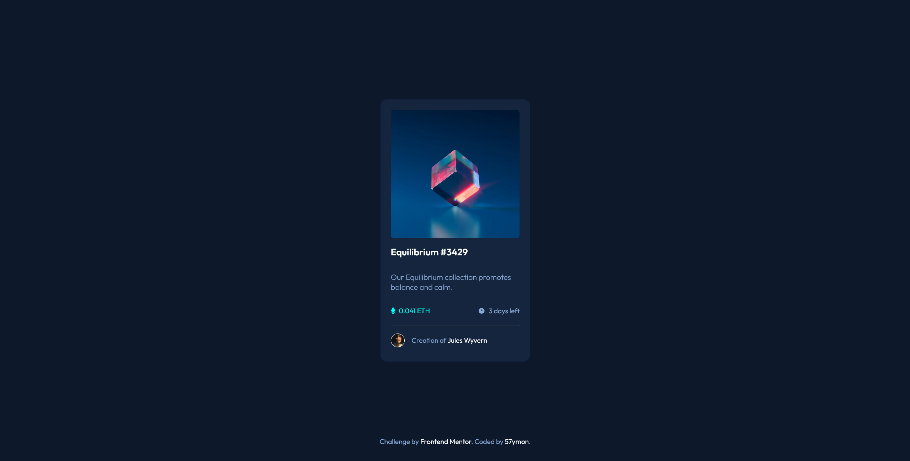

# Frontend Mentor - NFT preview card component solution

This is a solution to the [NFT preview card component challenge on Frontend Mentor](https://www.frontendmentor.io/challenges/nft-preview-card-component-SbdUL_w0U). Frontend Mentor challenges help you improve your coding skills by building realistic projects.

## Table of contents

-   [Overview](#overview)
    -   [The challenge](#the-challenge)
    -   [Screenshot](#screenshot)
    -   [Links](#links)
-   [My process](#my-process)
    -   [Built with](#built-with)
-   [Author](#author)

**Note: Delete this note and update the table of contents based on what sections you keep.**

## Overview

### The challenge

Users should be able to:

-   View the optimal layout depending on their device's screen size
-   See hover states for interactive elements

### Screenshot

### Links

-   Solution URL: [Add solution URL here](https://www.frontendmentor.io/solutions/nft-card-component-HXSKfBgqY8)
-   Live Site URL: [Add live site URL here](https://nft-52ymon.netlify.app/)

## My process

-   I think I had a small breakdown while doing this challenge. Ofc the w3schools.com was a massive help with this one. I had to rewrite my css 3 times and then it finally worked as I wanted. Had 2 breakes, one for a coffee and thinking about what am I doing with my life, and one for a little cry under a shower. Thankfully it's done now and I'm sure I learned a lot from it.

### Built with

-   Semantic HTML5 markup
-   CSS custom properties
-   Flexbox

## Author

-   Website - [Add your name here](https://github.com/52ymon)
-   Frontend Mentor - [@52ymon](https://www.frontendmentor.io/profile/52ymon)
